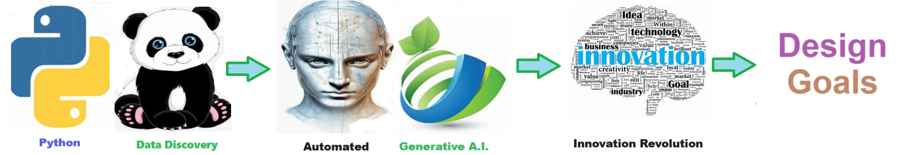

# Design Goal - Having shared design goals within a development team promotes alignment, efficiency, and quality in the development process.
Having shared design goals within a development team promotes alignment, efficiency, and quality in the development process.

Having shared design goals within a development team promotes alignment, efficiency, and quality in the development process. It fosters teamwork and accountability, ensuring that efforts are focused on achieving common objectives. Ultimately, adhering to these goals leads to higher-quality solutions that meet user needs effectively and contribute to the overall success of the project.
## design_goal [
    {
        "goal": "EXTENSIBILITY",
        "description": "Extensibility is an ability to add or extend additional elements and features to the existing solution."
    },
    {
        "goal": "ACCESSIBILITY",
        "description": "The ability for authorized users to easily access and use the solution from anywhere."
    },
    {
        "goal": "MAINTAINABILITY",
        "description": "The ability to easily manage and update the solution."
    },
    {
        "goal": "SECURITY",
        "description": "To secure the solution and data is only available to those who have appropriate access."
    },
    {
        "goal": "RELIABILITY",
        "description": "The solution works consistently and can be counted on from a business perspective and performs as expected."
    },
    {
        "goal": "PERFORMANT",
        "description": "The solution performs quickly enough to meet the business demand."
    },
    {
        "goal": "INTELLIGENT",
        "description": "The solution learns or provides new insights."
    },
    {
        "goal": "CONSISTENCY",
        "description": "Consistency means having solution work reliably and in the same manner every time."
    },
    {
        "goal": "SELF-DOCUMENTING",
        "description": "The solution should be able to produce its own documentation."
    },
    {
        "goal": "SELF-TESTING",
        "description": "Each component of the solution should be able to perform its own unit test."
    },
    {
        "goal": "TALKING",
        "description": "The solution should be smart enough to explain itself to a non-technical human."
    },
    {
        "goal": "SIMPLE",
        "description": "The solution should be lean and choose the simplest method of achievement."
    },
    {
        "goal": "PYTHONIC",
        "description": "If the solution is built in python it is built using the python way."
    },
    {
        "goal": "NO CODE-LOW CODE",
        "description": "The solution should contain the minimal code or no code required to achieve objective."
    }
] ## readme old # Design Goal - solution for Design_Goal

## Description

Welcome to the solution **Design Goal** 
A set of design goals for all business soltuions. 

solution for Design_Goal 

## Design Goals:
1. **EXTENSIBILITY** - Extensibility is an ability to add or extend additional elements and features to the existing solution.
2. **ACCESSIBILITY** - The ability for authorized users to easily access and use the solution from anywhere.
3. **MAINTAINABILITY** - The ability to easily manage and update the solution.
4. **SECURITY** - To secure the solution and data is only available to those who have appropriate access.
5. **RELIABILITY** - The solution works consistently and can be counted on from a business perspective and performs as expected.
6. **PERFORMANT** - The solution performs quickly enough to meet the business demand.
7. **INTELLIGENT** - The solution learns or provides new insights.
8. **CONSISTENCY** - Consistency means having solution work reliably and in the same manner every time.
9. **SELF-DOCUMENTING** - The solution should be able to produce its own documentation.
10. **SELF-TESTING** - Each component of the solution should be able to perform its own unit test.
11. **TALKING** - The solution should be smart enough to explain itself to a non-technical human.
12. **SIMPLE** - The solution should be lean and choose the simplest method of achievement.
13. **PYTHONIC** - If the solution is built in python it is built using the python way.
14. **NO CODE-LOW CODE** - The solution should contain the minimal code or no code required to achieve objective.

## Features

- Easy to understand and use  
- Easily Configurable 
- Quickly start your project with pre-built templates
- Its Fast and Automated

## Notebook Features

- Self Documenting 
- Self Testing 
- Easily Configurable
- Includes Talking Code - The code explains itself
- Self Logging 
- Self Debugging 
- Low Code - or - No Code
- Educational 

## Getting Started

To get started with the Design Goal solution, follow these steps:

1. Clone the repository to your local machine.
2. Install the required dependencies listed at the top of the notebook.
3. Explore the example code provided in the repository and experiment.
4. Run the notebook and your find your most Critical Data - EASY !

## Getting Started
To get started with the **Design Goal** solution repository, follow these steps:
1. Clone the repository to your local machine.
2. Install the required dependencies listed at the top of the notebook.
3. Explore the example code provided in the repository and experiment.
4. Run the notebook and make it your own - **EASY !**
    
## https://github.com/JoeEberle/ -- josepheberle@outlook.com 
    

 ## readme_II 
# Design Goal - Having shared design goals within a development team promotes alignment, efficiency, and quality in the development process.
Having shared design goals within a development team promotes alignment, efficiency, and quality in the development process.

Having shared design goals within a development team promotes alignment, efficiency, and quality in the development process. It fosters teamwork and accountability, ensuring that efforts are focused on achieving common objectives. Ultimately, adhering to these goals leads to higher-quality solutions that meet user needs effectively and contribute to the overall success of the project.

## Features
- Easy to understand and use  
- Easily Configurable 
- Quickly start your project with pre-built templates
- Its Fast and Automated

## Notebook Features
- **Self Documenting** - Automatically identifes major steps in notebook 
- **Self Testing** - Unit Testing for each ptyhon function
- **Easily Configurable** -easily modifyable with config.INI name value pairs
- **Includes Talking Code** - The code explains itself.
- **Self Logging** - enhanced python standard logging   
- **Self Debugging** - enhanced python standard debugging
- **Low Code - or - No Code** - Most solutions are under 50 lines of code
- **Educational** - Includes educational dialogue and background material
    
## Getting Started
To get started with the **Design Goal** solution repository, follow these steps:
1. Clone the repository to your local machine.
2. Install the required dependencies listed at the top of the notebook.
3. Explore the example code provided in the repository and experiment.
4. Run the notebook and make it your own - **EASY !**
    
## https://github.com/JoeEberle/ -- josepheberle@outlook.com 
    

        ## solution_description 
Having shared design goals within a development team promotes alignment, efficiency, and quality in the development process. It fosters teamwork and accountability, ensuring that efforts are focused on achieving common objectives. Ultimately, adhering to these goals leads to higher-quality solutions that meet user needs effectively and contribute to the overall success of the project.
 

## Features
- Easy to understand and use  
- Easily Configurable 
- Quickly start your project with pre-built templates
- Its Fast and Automated

## Notebook Features
- **Self Documenting** - Automatically identifes major steps in notebook 
- **Self Testing** - Unit Testing for each ptyhon function
- **Easily Configurable** -easily modifyable with config.INI name value pairs
- **Includes Talking Code** - The code explains itself.
- **Self Logging** - enhanced python standard logging   
- **Self Debugging** - enhanced python standard debugging
- **Low Code - or - No Code** - Most solutions are under 50 lines of code
- **Educational** - Includes educational dialogue and background material
    
## Getting Started
To get started with the **Design Goal** solution repository, follow these steps:
1. Clone the repository to your local machine.
2. Install the required dependencies listed at the top of the notebook.
3. Explore the example code provided in the repository and experiment.
4. Run the notebook and make it your own - **EASY !**
    
## https://github.com/JoeEberle/ -- josepheberle@outlook.com 
    

       